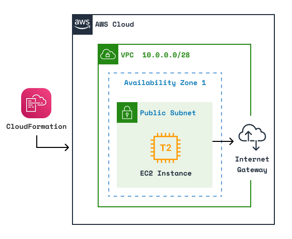
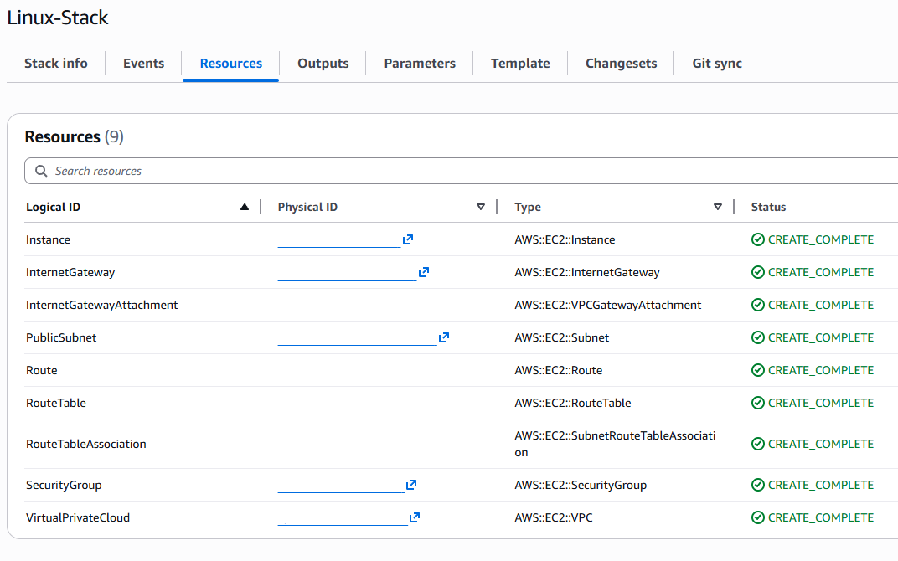
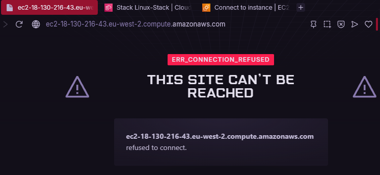
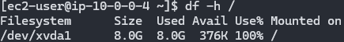
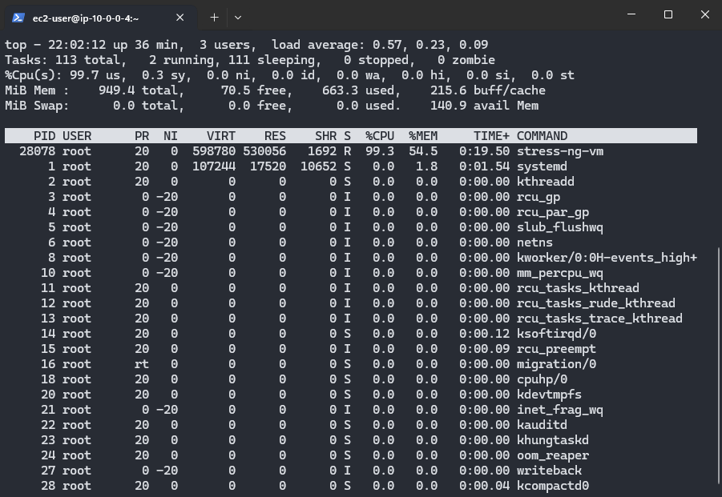

# Linux SysAdmin Lab (AWS EC2)

## Overview
Single-instance Linux 2023 6.1 EC2 lab demonstrating troubleshooting and automation.

## Architecture
- AWS EC2 t2.micro instance
- Security Group: SSH 22, HTTP 80

architecture-diagram PLACEHOLDER


## CloudFormation Deployment

You may also deploy this architecture using the [main.yaml](/infrastructure/main.yaml) template file in [/infrastructure](/infrastructure/).



Before deploying the stack, make sure to create a key pair so you can access the instance via SSH.

Once deployed, connect to the instance and configure the following:
```
sudo yum install httpd -y 
sudo systemctl start httpd
sudo systemctl enable httpd
```

**Make sure to delete the stack once finished to minimise costs.**

## Incidents Simulated
### Incident 1 - Web Server Failure



**Symptoms:** HTTP site inaccessible  
**Diagnosis:** sudo systemctl status httpd shows stopped  
**Resolution:** sudo systemctl start httpd  
**Verification:** Site accessible once again  

### Incident 2 - Low Disk Space



**Symptoms:** Disk warning / files not saving   
**Diagnosis:**  df -h / shows 100% disk utilisation  
**Resolution:**  sudo rm to remove large files  
**Verification:** df -h / 6.4G of available space  

### Incident 3 - Memory Pressure / Swap Configuration



**Symptoms:** Sluggish performance, SSH lag   
**Diagnosis:** top, free -h, vmstat commands  
**Resolution:** created and enabled 1 GB swap file  
**Verification:** system responsive, swap active  

## Automation
WIP PLACEHOLDER

### Optional scheduled scripts for hourly checks:
WIP PLACEHOLDER

## Skills Demonstrated
- Linux Instance Administration & Troubleshooting  
- Bash Automation  
- AWS EC2 Management  
- Incident Diagnosis and Documentation
- CloudFormation Templating & Deployment  

## Next Steps
- Automation/Scripts
- CloudWatch monitoring
- SNS alerting
